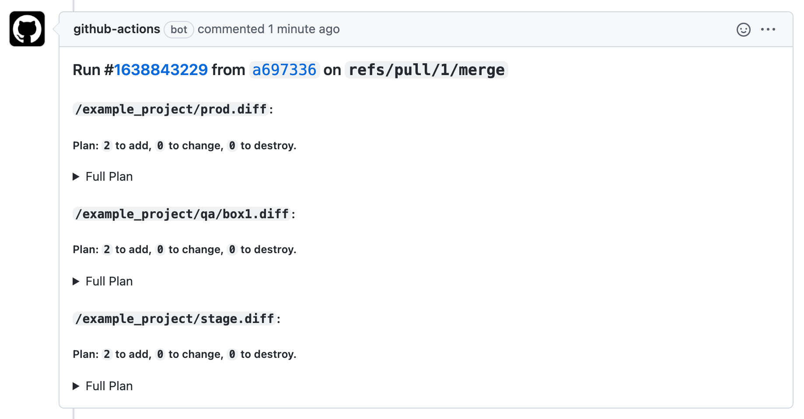

# gh-action-terragrunt-report

Github Action which post multiple terraform plan outputs as comment in pull requests.

This action is inspired by the [ahmadnassri/action-terraform-report](https://github.com/ahmadnassri/action-terraform-report) action.
It does something similar, but with multiple terraform diff files generated by [terragrunt](https://terragrunt.gruntwork.io/).

## Problem

If you use terragrunt to orchestrate multiple terraform state, you run into the issue that the output of terragrunt will become super noisy if you use `run-all plan` in your pipelines.

By adjusting your `terragrunt.hcl` config and using this action, the plan output will be written in multiple files. These files will be picked up by this action and added as a comment inside a pull-request.

## Usage

First you must adapt your `terragrunt.hcl` so that all terraform plans are stored in separate files and converted from it's binary representation to text output.

This can be done with the help of [`extra_arguments`](https://terragrunt.gruntwork.io/docs/features/keep-your-cli-flags-dry/) and [`after_hook`](https://terragrunt.gruntwork.io/docs/features/before-and-after-hooks/#before-and-after-hooks) in your general `terragrunt.hcl` file (mostly at the root of your repo):
```hcl
terraform {
  extra_arguments "plan-output" {
    commands = ["plan"]
    arguments = ["-out=${path_relative_from_include()}/${path_relative_to_include()}.tfplan"]
  }

  after_hook "plan_diff" {
    commands     = ["plan"]
    execute      = ["bash", "-c", "terraform show -no-color ${path_relative_from_include()}/${path_relative_to_include()}.tfplan > ${path_relative_from_include()}/${path_relative_to_include()}.diff"]
  }
}
```

This will write all terraform plan output as `.tfplan` files in their respective folder (e.g. `example_project/prod.tfplan`). And convert them afterwards into their text representation as `.diff` files (e.g. `example_project/prod.diff`).

Now you can use this action like following:
```yml
name: PR
on:
  pull_request:

jobs:
  test:
    name: 'Terragrunt'
    runs-on: ubuntu-latest
    env:
      tf_version: 'latest'
      tg_version: 'latest'
    steps:
      - name: Checkout
        uses: actions/checkout@v2
      - name: Setup Terragrunt
        uses: autero1/action-terragrunt@v1.1.1
        with:
          terragrunt_version: latest
      - name: Setup Terraform
        uses: hashicorp/setup-terraform@v1.2.1
        with:
          terraform_wrapper: false
      - name: Plan all
        run: |
          cd example_project
          terragrunt run-all plan
      - name: Report plans
        uses: visable-dev/gh-action-terragrunt-report@v2
```

## Inputs

The following inputs can be adjusted if necessary:

| input | default | description |
| ----- | ------- | ----------- |
| `github_token` | `${{ github.token }}` | Token used to post comment. |
| `diff_file_suffix` | `.diff` | Suffix of the diff output files. Whole workspace will be scanned for such files. |
| `search_path` | `${{ github.workspace }}` | Path used to search for diff files. |

## Screenshots



