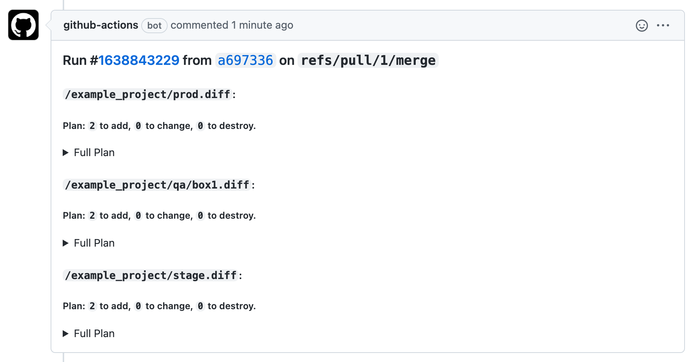
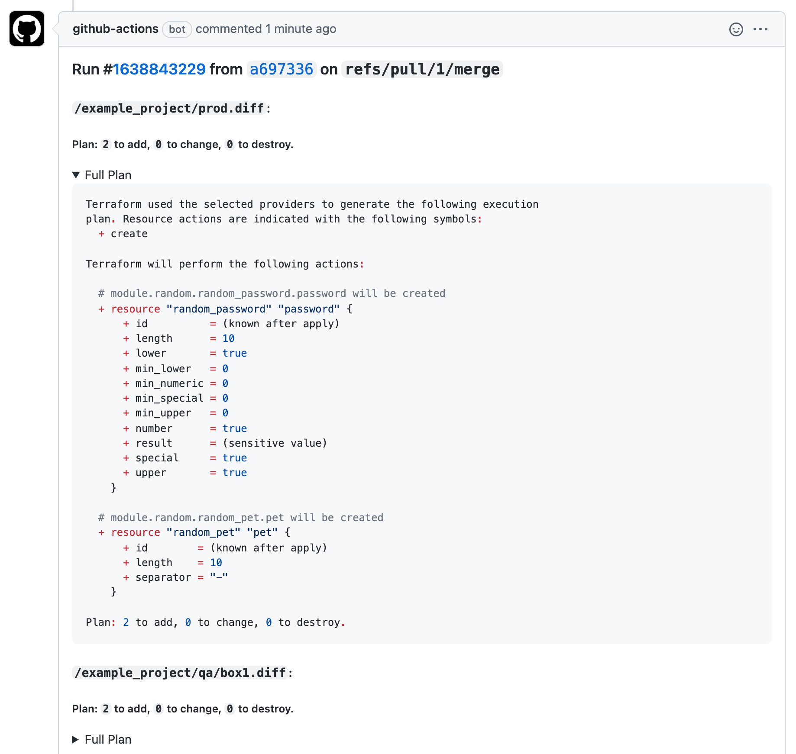

# gh-action-terragrunt-report

Github Action which creates status checks for multiple terraform plan outputs in pull requests.

This action is inspired by the [ahmadnassri/action-terraform-report](https://github.com/ahmadnassri/action-terraform-report) action.
It does something similar, but with multiple terraform diff files generated by [terragrunt](https://terragrunt.gruntwork.io/).

## Problem

If you use terragrunt to orchestrate multiple terraform state, you run into the issue that the output of terragrunt will become super noisy if you use `terragrunt run --all plan` in your pipelines.

By adjusting your Terragrunt root config and using this action, the plan output will be written in multiple files. These files will be picked up by this action and added as status checks inside a pull-request.

## Usage

First you must adapt your `root.hcl` (or legacy `terragrunt.hcl`) so that all terraform plans are stored in separate files and converted from it's binary representation to text output.

This can be done with the help of [`extra_arguments`](https://terragrunt.gruntwork.io/docs/features/keep-your-cli-flags-dry/) and [`after_hook`](https://terragrunt.gruntwork.io/docs/features/before-and-after-hooks/#before-and-after-hooks) in your root Terragrunt config file:
```hcl
terraform {
  extra_arguments "plan-output" {
    commands = ["plan"]
    arguments = [
      "-out=${get_terragrunt_dir()}/${basename(path_relative_to_include())}.tfplan"
    ]
  }

  after_hook "plan_diff" {
    commands = ["plan"]
    execute  = ["bash", "-c", "terraform show -no-color ${get_terragrunt_dir()}/${basename(path_relative_to_include())}.tfplan > ${get_terragrunt_dir()}/${basename(path_relative_to_include())}.diff"]
  }
}
```

This will write all terraform plan output as `.tfplan` files in their respective folder (e.g. `example_project/prod.tfplan`). And convert them afterwards into their text representation as `.diff` files (e.g. `example_project/prod.diff`).

Now you can use this action like following:
```yml
name: PR
on:
  pull_request:

jobs:
  test:
    name: 'Terragrunt'
    runs-on: ubuntu-latest
    steps:
      - name: Checkout
        uses: actions/checkout@v6
      - name: Setup Terraform
        uses: hashicorp/setup-terraform@v4
        with:
          terraform_wrapper: false
          terraform_version: ${{ vars.TERRAFORM_VERSION }}
      - name: Setup Terragrunt
        run: |
          curl -fsSL "https://github.com/gruntwork-io/terragrunt/releases/download/v${{ vars.TERRAGRUNT_VERSION }}/terragrunt_linux_amd64" \
            -o /usr/local/bin/terragrunt
          chmod +x /usr/local/bin/terragrunt
      - name: Plan all
        run: |
          cd example_project
          terragrunt run --all plan --non-interactive
      - name: Report plans
        uses: visable-dev/gh-action-terragrunt-report@v2
```

## Pretty check names

By default we use the filename of a diff file as the name of a check.
This can lead to super long names in complex environments.

To avoid this a regex in `pretty_name_regex` can be specified.
This regex should contain capture groups.
It will be applied on the filename of every diff file and all capture groups will be joined with `pretty_name_separator` into a prettier name.

If `pretty_name_regex` is not set or no match found, the filename will be used as name.

### Example

If the generated diff files in your project look like this:

```
/example_project/prod/prod.diff
/example_project/qa/box1/box1.diff
/example_project/stage/stage.diff
```

you can set `pretty_name_regex` to `/example_project/([\w/]+)/(\w+)\.diff`, so that the converted names will look as following:

```
prod/prod
qa/box1/box1
stage/stage
```

## Inputs

The following inputs can be adjusted if necessary:

| input | default | description |
| ----- | ------- | ----------- |
| `github_token` | `${{ github.token }}` | Token used to post comment. |
| `diff_file_suffix` | `.diff` | Suffix of the diff output files. Whole `search_path` will be scanned for such files. |
| `search_path` | `${{ github.workspace }}` | Path used to search for diff files. |
| `pretty_name_regex` | - | Regex to prettify the name used for status checks. Will be applied on filename of every found diff file. Included capture groups will be joined with `pretty_name_separator` and used as name of status check. If not present or not groups matched, the path to the diff file will be used.|
| `pretty_name_separator` | `/` | Separator used to create status check name. Only used if `pretty_name_regex` is set. |
| `no_diff_conclusion` | `failure` | Use this conclusion when no diff is found. Choose from `success` or `failure`. |

## Screenshots



